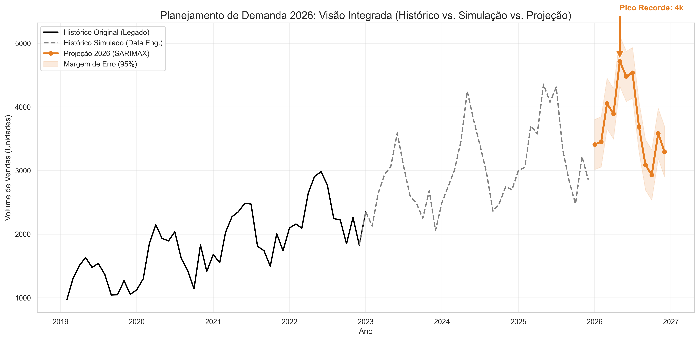

# 📈 Strategic Demand Forecasting: Data Augmentation & Causal Modeling


## 💼 Visão Executiva (Business Overview)

Este projeto não é apenas um exercício de previsão de séries temporais; é uma solução completa de **Planejamento Estratégico de Demanda**.

O objetivo principal foi superar um desafio comum no mundo real: **A falta de dados recentes e a necessidade de simular cenários futuros condicionados a decisões de negócio.** Em vez de apenas projetar uma linha de tendência baseada no passado (modelos univariados), construí um **Ecossistema de Inferência Causal**. O modelo final (SARIMAX) não prevê apenas "quanto vamos vender", mas responde à pergunta: *"Se aumentarmos o investimento em Marketing e aplicarmos descontos agressivos, qual será a resposta da demanda?"*

---

## 🛠️ O Desafio Técnico (The Problem)

O dataset original continha dados transacionais históricos até **2022**. Para realizar um planejamento orçamentário para o ano fiscal de **2026**, foi necessário:

1.  **Preencher a lacuna temporal (2023-2025):** Criar dados sintéticos realistas que respeitassem a sazonalidade e a distribuição geográfica original.
2.  **Incorporar Causalidade:** O volume de vendas não podia ser aleatório; ele precisava ser uma consequência matemática de variáveis controláveis (Marketing e Preço).
3.  **Modelar o Futuro (2026):** Treinar um modelo capaz de ler essas variáveis exógenas e projetar a demanda.

---

## 🚀 Arquitetura da Solução

O projeto foi estruturado em um pipeline de 3 etapas:

### 1. Análise Exploratória (`1.0-analise-exploratoria`)
Diagnóstico profundo do histórico (2019-2022).
* Identificação de Sazonalidade (Picos em Nov/Dez).
* Análise de Pareto (Quais produtos/regiões carregam o faturamento).
* Decomposição de Séries Temporais.

### 2. Engenharia de Dados & Simulação (`2.0-engenharia-de-dados`)
A etapa mais complexa do projeto. Utilizei técnicas de **Data Augmentation** para simular um cenário de recuperação de mercado entre 2023 e 2025.
* **Criação de Variáveis Exógenas:** Simulei curvas de investimento em Marketing (tendência de alta) e Taxas de Desconto (picos na Black Friday).
* **Cálculo de Elasticidade:** As vendas de 2023-2025 não foram "chutadas". Elas foram calculadas usando elasticidade-preço e retorno sobre investimento (ROAS).
    > *Fórmula: Vendas = Sazonalidade × (Log(Marketing) × Elasticidade) × (Desconto ^ Sensibilidade)*

### 3. Modelagem Causal - SARIMAX (`3.0-modelagem-sarimax`)
Substituí modelos clássicos (Holt-Winters) pelo **SARIMAX**, permitindo a inclusão de variáveis externas.
* **Treino:** O modelo aprendeu a correlação entre "Gastar mais em Ads" e "Vender mais".
* **Forecast 2026:** Projetei um cenário agressivo para 2026 (Recorde Histórico) e o modelo calculou a demanda necessária para suportar esse plano.

---

## 📊 Resultados Visuais

### A Visão Integrada: Passado, Simulação e Futuro
O gráfico abaixo demonstra a continuidade perfeita entre os dados legados (Preto), a engenharia de dados (Cinza) e a previsão da IA (Laranja).



*Observe como o modelo SARIMAX (Laranja) replica com precisão os picos de final de ano, respondendo ao aumento planejado de Marketing e Descontos para 2026.*

---

## 💻 Stack Tecnológico

* **Linguagem:** Python 3.x
* **Manipulação de Dados:** Pandas, NumPy
* **Estatística & Modelagem:** Statsmodels (SARIMAX, Exponential Smoothing)
* **Visualização:** Matplotlib, Seaborn
* **Conceitos:** Time Series Analysis, Causal Inference, Data Augmentation.

---

## 📂 Estrutura do Repositório

```text
├── data/
│   ├── raw/                  # Dados originais (imutáveis)
│   ├── processed/            # Dados com variáveis exógenas geradas (Output do notebook 2.0)
│   └── outputs/              # CSVs finais com as previsões
├── notebooks/
│   ├── 1.0-analise-exploratoria.ipynb    # EDA e Diagnóstico
│   ├── 2.0-engenharia-de-dados.ipynb     # Geração de Cenários e Variáveis Causais
│   ├── 3.0-modelagem-sarimax.ipynb       # Treinamento e Previsão 2026
│   └── assets/                           # Imagens e Gráficos gerados
└── README.md
---
## Conclusão